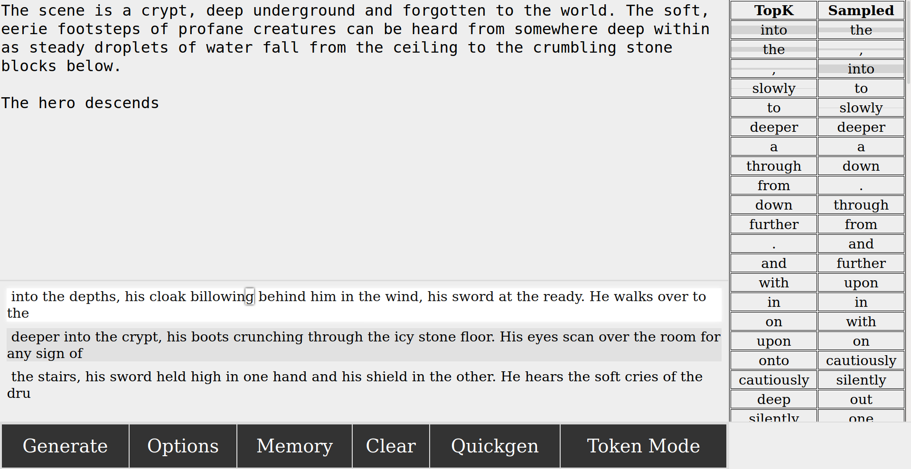

# mimitext

## Overview

Mimitext is an interface to Huggingface's transformers library, providing a proof-of-concept user interface for the purposes of inference. It generates text based on the text you give it, with a number of configurable options.

This is provided via **Flask** and runs on **localhost**. Despite being a simple webserver, mimitext is currently *not intended for more than one user at a time.* It will likely break horribly in that scenario *and is not secure against random users.* However, the webserver component means it can be easily run on a distant machine and operated from another. For this, I recommend *ssh -D*. Again, this isn't intended to be public-facing.

Possibly unique to mimitext is that it also allows you to peek at the possible next tokens for a given input. For instance, you can view the TopK and SoftMax results from attempting to move the model forward. These tokens can be added to the text-so-far with a click. Of course, conventional string generation (currently provided by `generate` is still available.

When text is generated normally, the user can click on a letter in the possible result to add the text *up to* that letter, rather than being forced to accept the whole result. This should allow an easier way to move forward with less manual editing.

**Warning!** This is new and heavily in-progress. It may break in subtle, unexpected ways. The GUI is also under heavy construction.

## Sample

Three responses wait in the response panel. A list of TopK tokens and the tokens after SoftMax are in the rightmost panel. The user is highlighting the "m" in room: a click will only select the text up to and including the "m". If the user clicks a token, such as "into", that will be added instead. If Quickgen were selected, the next step would proceed automatically. As is, the user must click generate to continue.

## GUI
There are five buttons making up the webgui right now.

### Generate
This sends a request to the server, which is then sent to the model, via POST. The button turns black when a reply from the server is pending. If it stays that way, it's likely the server encountered an error. It's best to refresh the page and reload the program if this happens.

### Options
This displays the **Generation Options** seen below.

### Clear
This will erase both the possible responses (below the main text) and the list of possible tokens (in token mode). This does NOT erase the text so far in the main panel.

### Quickgen
When a possible response is clicked, or a token is clicked, the next generate request is made automatically (as if the user had clicked Generate immediately afterward.)

### Token Mode
In Token Mode, only a response length of 1 is used. However, the user can view many of the possibilities and decide which one they wish to keep, instead of letting the model decide by the probability score. This disables the response generation entirely. Looking at only one token's possibilities this way is very fast.

## Generation Options
These are almost identical to the transformers `generate` call; the values from the interface are passed directly into it.

### Autogenerate
This simply repeats the generation request after one is returned. The number is how many repeats. For instance, setting it to three is identical to just hitting "Generate" three times in a row.

### Temperature
Randomness. 0.3~0.7 is a good area to try for many models. *This value impacts the result of the SoftMax column in the Token mode.*

### Number of Responses
This passes a request for multiple responses to `generate`. This can be faster than generating multiple sequences one at a time, but it appears to impact the ram/video ram usage of the model.

### Response Length
The length (in tokens) to request from the model. These are sometimes words, parts of words, individual letters, or less.

### top_p (nucleus) sampling
In a nutshell, this restricts the random choice of the next token to a cumulative probability. This can allow a large number of reasonably likely tokens to be considered while pruning the tokens the model thinks are very unlikely. Try values between 0.90 and 0.95 if you use it at all, or simply leave it at 1.

### top_k sampling
Restricts the possible results to the x most likely tokens. 0 to disable.

### Repetition Penalty
Higher values penalize tokens that have appeared in the input more and more, encouraging the responses to feel new. This sometimes has an unintended effect, as many tokens show up many times (the, The, names, and so on.)
Currently this has no impact on the token list that's generated in token mode.

### num_beams
A minimal way to describe beam search is that it attempts to gather a sequence with the overall highest probability, rather than just the series of most likely tokens. Setting it to 1 disables it. This may impact ram/video ram usage.
