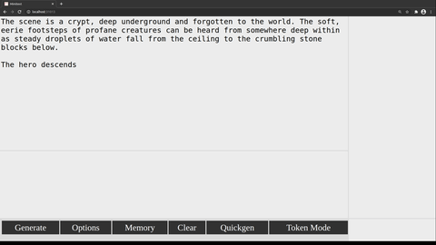

# mimitext

## Launching
After installing the requirements via a method like `python -m pip install -r requirements.txt`,

`python main.py /path/to/your/model`

or

`python.exe main.py C:\path\to\your\model`

Huggingface's list of models ( https://huggingface.co/models ) are also appropriate arguments:

`python main.py EleutherAI/gpt-neo-1.3B`

## Overview

Mimitext is an interface to Huggingface's transformers library, providing a simple user interface for customized inference. It generates text based on the text you give it. This can be used as a writing aid, for experimentation on an AI model, or played like an interactive story. There are a number of configurable options and a few features that I believe are unique to this software at the time of writing.

It's caleld Mimitext because of my username and because after nine days I couldn't think of a good name.

This is provided via **Flask** and runs on **localhost**. Despite being a simple webserver, mimitext is currently *not intended for more than one user at a time.* It will likely break horribly in that scenario right now, although a goal is to make it functional for a small number of users. It still isn't intended to be public-facing, where malicious users could intentionally send requests to slow it down.

However, the webserver component means it can be easily run on a distant machine and operated from another. For this, I recommend *ssh -D*. Again, this isn't intended to be public-facing either, but it may be convenient for certain uses.

Possibly unique to Mimitext is that you can view single token probabilities instead of generating entire text sequences. As an example, if you input "The", enable "Token Mode" and then hit "Generate", the rightmost column will fill with a table of tokens. The inner shading represents the probability of that token being sampled for use out of the 100 tokens the table is limited to. This lets you take a peek at what the model might be "thinking" of adding, but may never actually reach. Clicking one such token adds it to the text as usual, and if "Quickgen" is enabled, a new batch of tokens is made off the new total text input.

Another novel feature is that when text is generated normally, the user can click on a letter in the possible result to add the text *up to* that letter, rather than being forced to accept the whole result. This should allow an easier way to move forward with less manual editing. If you get a sequence of 50 tokens, but only want the first 10, a single click will truncate the other forty—and if "Quickgen" is on, the next sequence(s) will begin to generate automatically.

The page brings in an almost blank `custom.css` which may be used to theme the program in any way you like.

**Warning!** This is new and heavily in-progress. It may break in subtle, unexpected ways. The GUI is also under heavy construction and subject to constant tinkering.

## Sample

The text, which can be freely altered, is in the upper-left panel. New responses or tokens are added here, when clicked upon.

Three separate responses wait in the response panel (bottom). The `g` is highlighted: the response is only added up to the point the user clicks on, allowing them to quickly accept a partial response before generating another.

On the right: Two lists of the top 100 tokens can be clicked on if the user wants more control over the progression. Additionally, the darker inner shading through the words represents the probability of each token being chosen randomly. The tokens are sorted from most to least likely. In this case, `into` is the most likely candidate, but when a random sample was performed, chance chose `the` instead.

## Animated Sample

## GUI
There are several buttons making up the main GUI right now.

### Generate
This sends a request to the server, which is then sent to the model, via POST. The button turns black when a reply from the server is pending. If it stays that way, it's likely the server encountered an error. It's best to refresh the page and reload the program if this happens until more robust erorr handling and recovery is implemented.

### Options
This displays the **Generation Options** seen below.

### Memory
Opens the **Memory** window. Here you can add a Note and fill the Memory box. They work a little differently: memory is prepended to the text in the main window, while note is placed somewhere in that text when the model begins to process it. Both can be used to impact the results of text generation and to "steer" it toward "remembering" certain things.

There are two values here as well: **Share** and **Note Insertion**

#### Share
The share between memory and the main text. This value is applied after the response length. As an example, at the 1024 token default maximum (appropriate for GPT2) and a response length of **40** the share value works like this: 1024 tokens, minus 40 so there's room for the response (now 984) the main text reserves at least 75% of that (738 tokens) leaving 984 * .25 (246) tokens for the memory window. You can put in more memory than this, and the program will use what it can and get rid of the earliest memory tokens if necessary.

#### Note Insertion
The note is inserted on the basis of lines. By default, it goes back three lines into the text and places it there. *Be warned! Using a value like 1 will change the way tokens are generated in Token Mode. For each newline added, the note will follow, and that may cause the model to want another newline as padding, over and over.*

### Clear
This will erase both the possible responses (below the main text) and the list of possible tokens (in token mode). This does NOT erase the text window.

### Quickgen
When a possible response is clicked, or a token is clicked, the next generate request is made automatically (as if the user had clicked Generate immediately afterward.)

### Token Mode
In Token Mode, only a response length of 1 is used. However, the user can view many of the possibilities and decide which one they wish to keep, instead of letting the model decide by the probability score. This disables the response generation entirely. Looking at only one token's possibilities this way is very fast - roughly the same as using response length = 1 with normal generation. This can be useful when the model is "stumped" and dead-set on a crummy response.

## Generation Options
These options will affect the way text is generated. Some are passed straight to `transformers`, while others control the program execution itself.

### Autogenerate
This simply repeats the generation request after one is returned. The number is how many repeats. For instance, setting it to three is identical to just hitting "Generate" three times in a row. There's currently no way to abort this process, so don't accidentally enter a huge number.

### Temperature
Affects randomness (which also applies to the values seen in Token Mode.)
Values below 1 increase the likelihood of likely results (generally resulting in coherent messages) while values above 1 effectively reduce the likelihood of all results.
0.5 is often a safe value, but a range from 0.3 to nearly 1.0 is worth trying. Try values over 1 for really entertainingly strange responses.

### Number of Responses
This passes a request for multiple responses to `generate`. This can be faster than generating multiple sequences one at a time, but it appears to impact the ram/video ram usage of the model. If you get Out-of-Memory crashes, this may be the culprit.

### Response Length
The length (in tokens) to request from the model. These are sometimes words, parts of words, individual letters, or less.

### top_p
In a nutshell, this restricts the random choice of the next token to a cumulative probability. This can allow a large number of reasonably likely tokens to be considered while pruning the tokens the model thinks are very unlikely. Try values between 0.90 and 0.95 if you use it at all, or simply leave it at 1.

### top_k
Restricts the possible results to the x most likely tokens. 0 to disable.

### Repetition Penalty
Higher values penalize tokens that have appeared in the input more and more, encouraging the responses to feel new. This sometimes has an unintended effect, as many tokens show up many times (the, The, names, and so on.) Consider values from 1 (off) to 1.25 at first.
Currently this has no impact on the token list that's generated in token mode.

### num_beams
A minimal way to describe beam search is that it attempts to gather a sequence with the overall highest probability, rather than just the series of most likely tokens. Setting it to 1 disables it. This may impact ram/video ram usage.
